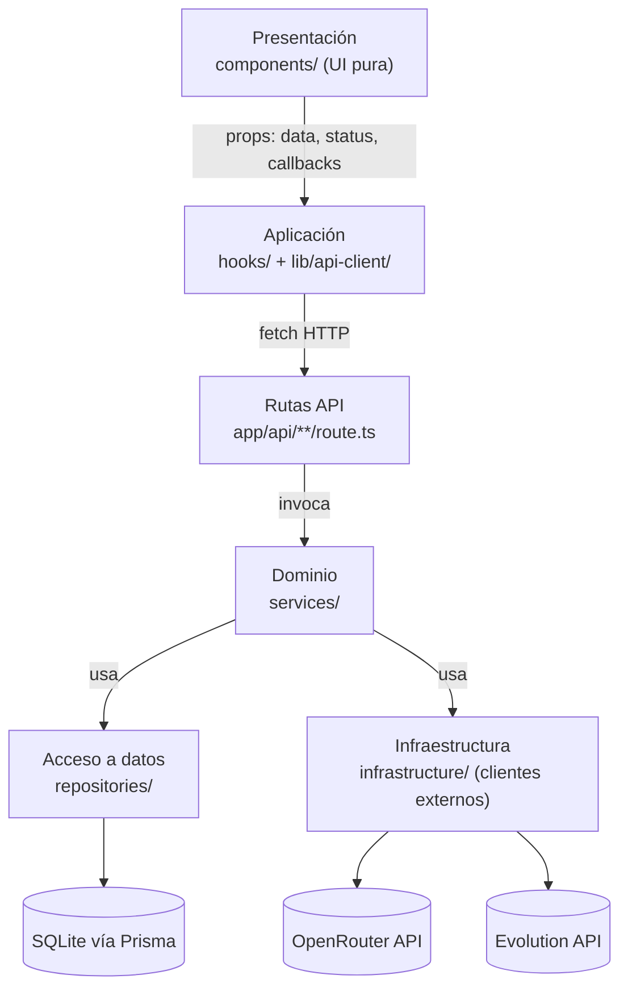

# El Proyecto
Este proyecto es un panel de control para la gestión de bots de WhatsApp basado en Next.js que integra la API de Evolution y una base de datos SQLite local. Ofrece una interfaz en tiempo real y basada en eventos para conectar, gestionar y supervisar una instancia de WhatsApp.

## Arquitectura en capas

### Principio rector

> **La UI nunca sabe de dónde vienen los datos.** Un componente solo recibe `props` (datos ya resueltos, estado de carga/error, y callbacks) y decide qué pintar. Toda obtención de datos, orquestación y reglas de negocio vive **fuera** de `components/`.

Esto se traduce en una regla de dependencias de una sola dirección:



**Ninguna capa puede saltarse una capa intermedia ni importar hacia "arriba".** En particular:

- `components/**` nunca importa `services/`, `repositories/`, `infrastructure/`, ni hace `fetch` directamente.
- `hooks/**` nunca importa `services/`, `repositories/` ni Prisma. Solo llama a `app/api/**` a través de `lib/api-client/**`.
- `app/api/**/route.ts` nunca contiene reglas de negocio ni acceso a datos directo: valida el input (con `zod`) y delega a un `service`.
- `services/**` nunca importa Prisma directamente ni construye URLs de OpenRouter/Evolution: usa `repositories/` e `infrastructure/`.
- `repositories/**` es el único lugar que conoce Prisma/SQL.
- `infrastructure/**` es el único lugar que conoce las URLs, headers y formatos de payload de OpenRouter y Evolution API.

### Descripción de cada capa

| Capa | Carpeta | Responsabilidad | Lo que NO debe hacer |
|---|---|---|---|
| **Presentación (UI)** | `components/` | Renderizar según `props`: datos, `status` (`loading/error/success/empty`) y callbacks (`onSave`, `onRetry`...). Incluye los *skeletons* de carga. | Hacer `fetch`, leer `.env`, contener reglas de negocio, decidir qué modelo usar, formatear payloads de API externas. |
| **Aplicación (orquestación de cliente)** | `hooks/`, `lib/api-client/` | Los *hooks* (`useBotConfig`, `useModels`, `useInstanceStatus`...) llaman a `lib/api-client/*` (wrappers de `fetch` a las rutas propias `/api/**`) y exponen un estado uniforme (`AsyncState<T>`, ver 3.3) más acciones (`save`, `refresh`). | Contener reglas de negocio del bot (eso vive en `services/`, en el servidor). |
| **Rutas API (borde del backend)** | `app/api/**/route.ts` | Parsear/validar el request (`zod`), invocar el `service` correspondiente, mapear la respuesta a HTTP (status codes, JSON). | Construir prompts, llamar a OpenRouter/Evolution directamente, hacer consultas SQL. |
| **Dominio (reglas de negocio)** | `services/` | Ej. `ChatService.handleIncomingMessage()`: decide cómo se arma el prompt, cuántos mensajes de historial incluir, qué hacer si el modelo falla, cómo se marca una conversación como archivada. | Conocer detalles de Prisma o de la forma exacta del payload HTTP de OpenRouter/Evolution (eso se delega). |
| **Acceso a datos** | `repositories/` | Encapsular Prisma: `BotConfigRepository.getActive()`, `ConversationRepository.getOrCreate(phone)`, `MessageRepository.appendMessage(...)`. | Contener lógica de negocio (ej. "cuántos mensajes de historial mandar" es decisión del `service`, no del repositorio). |
| **Infraestructura (clientes externos)** | `infrastructure/openrouter/`, `infrastructure/evolution/`, `infrastructure/db/` | Encapsular el detalle HTTP de cada proveedor externo y exponer métodos simples de dominio: `openrouterClient.chatCompletion(messages, model, temperature, maxTokens)`, `evolutionClient.sendText(phone, text)`, `evolutionClient.getQrCode(instance)`. | Contener reglas de negocio del bot. |

## Decisiones Arquitectónicas

### Segregación de comandos vs. eventos (REST vs. SSE)
La arquitectura divide estrictamente cómo el frontend envía acciones y cómo recibe respuestas asíncronas de Evolution API:

- **Comandos vía REST (`lib/api-client/`)**: acciones directas del usuario que requieren una respuesta inmediata (ej. hacer clic en "Vincular" llama a `POST /api/instance/connect`, o "Desvincular" llama a `DELETE /api/instance`). Los hooks delegan estas llamadas HTTP clásicas a los clientes API para iniciar procesos.
- **Observación vía SSE (`EventSource`)**: dado que Evolution API procesa actualizaciones de QR y cierres de sesión de forma asíncrona a través de webhooks, el frontend no hace polling para esperar el resultado. En su lugar, el hook `useInstanceConnection` escucha un stream `EventSource`. Cuando Evolution API confirma la creación o eliminación de una instancia, el servidor empuja el nuevo estado directamente a la UI.

### Pub/Sub en memoria
La transmisión en tiempo real se basa en un singleton `EventEmitter` nativo de Node. Debido a que el servidor Next.js procesa tanto las rutas de webhooks como los streams SSE en un solo contenedor, esto evita la sobrecarga de desplegar un broker de mensajería externo como Redis.

### Estado de desconexión personalizado
La UI utiliza un estado inventado (`'disconnecting'`) para proporcionar retroalimentación visual inmediata y precisa durante el proceso de desmontaje, mientras se espera a que Evolution API confirme el cierre de sesión real a través del webhook.

## Primeros pasos

Para ejecutar la aplicación localmente, asegúrate de que Docker Desktop esté en funcionamiento y sigue estos pasos:

1. Inicia el daemon de Docker:
   ```bash
   open -a docker
   ```
2. Compila e inicia los contenedores en modo desconectado:
   ```bash
   docker compose up --build -d
   ```
3. Abre tu navegador y ve a:
   ```bash
   http://localhost:3000
   ```

## Variables de entorno
Crea un archivo .env en el directorio raíz basándote en la estructura .env.example que se muestra a continuación. Estas variables conectan tu aplicación Next.js al contenedor de la API de Evolution y definen la URL de devolución de llamada de tu webhook.
```bash
# .env.example

# Aplicación Next.js
NODE_ENV=development
PORT=3000

# Configuración de la API de Evolution
EVOLUTION_API_URL=http://evolution-api:8080
EVOLUTION_API_KEY=tu_clave_de_API_segura_aquí

# Webhooks
# La URL que utilizará la API de Evolution para enviar eventos POST (mensajes, actualizaciones de conexión) a tu aplicación
APP_PUBLIC_WEBHOOK_URL=http://app:3000/api/webhook/evolution

# Base de datos
# Ruta a la base de datos SQLite local dentro del contenedor de Docker
DATABASE_URL="file:/app/data/dev.db"
```
